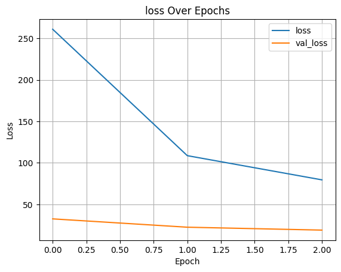
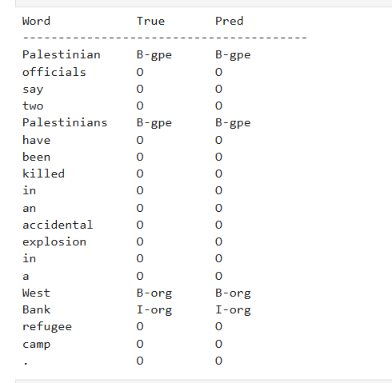

# DL- Developing a Deep Learning Model for NER using LSTM

## AIM
To develop an LSTM-based model for recognizing the named entities in the text.

## THEORY


## Neural Network Model
Include the neural network model diagram.

## DESIGN STEPS
### STEP 1: Data Collection and Preprocessing
Load text data with named entity annotations. Tokenize the text using a pre-trained tokenizer, convert tokens to input IDs, and create attention masks. Align labels with subword tokens.

### STEP 2: Prepare Dataset and DataLoader
Split data into training (80%) and testing (20%) sets. Create PyTorch DataLoader with appropriate batch sizes for efficient mini-batch processing.

### STEP 3: Design the BiLSTM-NER Architecture
Build a model with embedding layer, bidirectional LSTM layers for sequence processing, dropout for regularization, and a linear output layer with softmax for entity classification.

### STEP 4: Compile and Configure the Model
Define the loss function (CrossEntropyLoss for multi-class classification), optimizer (Adam), and evaluation metrics (precision, recall, F1-score).

### STEP 5: Train the Model
Train the BiLSTM model for multiple epochs, compute loss on training batches, perform backpropagation, and update model weights. Monitor validation loss to detect overfitting.

### STEP 6: Evaluate and Predict
Test the model on unseen data, generate entity predictions for sample texts, calculate performance metrics (accuracy, F1-score), and visualize predictions with entity labels.

## PROGRAM

### Name: AKASH CT

### Register Number: 212224240007

```python
class BiLSTMTagger(nn.Module):
    def __init__(self, vocab_size, tagset_size, embedding_dim=50, hidden_dim=100):
        super(BiLSTMTagger, self).__init__()
        self.embedding = nn.Embedding(vocab_size, embedding_dim)
        self.dropout = nn.Dropout(0.1)
        self.lstm = nn.LSTM(embedding_dim, hidden_dim, batch_first=True, bidirectional=True)
        self.fc = nn.Linear(hidden_dim * 2, tagset_size)

    def forward(self, x):
        x = self.embedding(x)
        x = self.dropout(x)
        x, _ = self.lstm(x)
        return self.fc(x)
```
```


model = BiLSTMTagger(len(word2idx) + 1, len(tag2idx)).to(device)
loss_fn = nn.CrossEntropyLoss()
optimizer = torch.optim.Adam(model.parameters(), lr=0.001)
```


# Training and Evaluation Functions
```
def train_model(model, train_loader, test_loader, loss_fn, optimizer, epochs=3):
    train_losses, val_losses = [], []
    for epoch in range(epochs):
        model.train()
        total_loss = 0
        for batch in train_loader:
            input_ids = batch["input_ids"].to(device)
            labels = batch["labels"].to(device)
            optimizer.zero_grad()
            outputs = model(input_ids)
            loss = loss_fn(outputs.view(-1, len(tag2idx)), labels.view(-1))
            loss.backward()
            optimizer.step()
            total_loss += loss.item()
        train_losses.append(total_loss)

        model.eval()
        val_loss = 0
        with torch.no_grad():
            for batch in test_loader:
                input_ids = batch["input_ids"].to(device)
                labels = batch["labels"].to(device)
                outputs = model(input_ids)
                loss = loss_fn(outputs.view(-1, len(tag2idx)), labels.view(-1))
                val_loss += loss.item()
        val_losses.append(val_loss)
        print(f"Epoch {epoch+1}: Train Loss = {total_loss:.4f}, Val Loss = {val_loss:.4f}")
    return train_losses, val_losses


train_losses, val_losses = train_model(model, train_loader, test_loader, loss_fn, optimizer, epochs=3)
```


### OUTPUT

## Loss Vs Epoch Plot


### Sample Text Prediction


## RESULT
Include your result here
